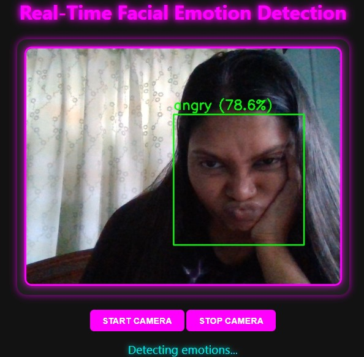
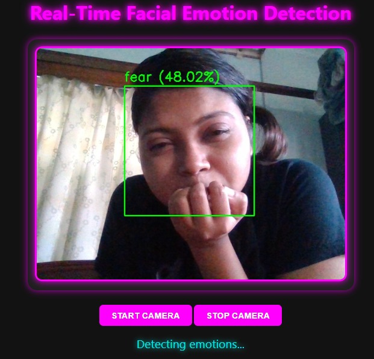
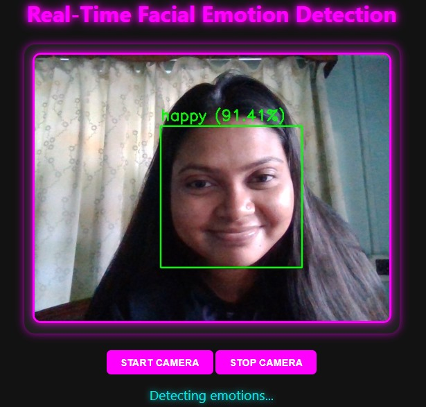
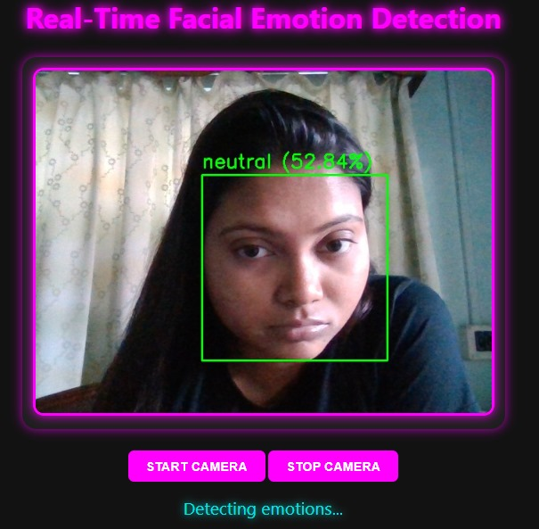
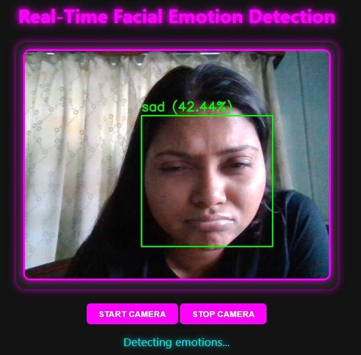

## Real-Time Face Emotion Detection😃

## Description 📌
A machine learning and computer vision project that detects and classifies human emotions in real-time from facial expressions. The system can recognize multiple emotions such as happy, sad, angry, surprised, neutral, and more, providing instant feedback through a web interface or desktop application.

## Features 🚀
- Detects faces in real-time using a webcam or video feed.
- Classifies emotions accurately using AI/ML models.
- Provides live visual feedback with emotion labels and confidence scores.
- User-friendly interface for seamless interaction.
- Built with Python, OpenCV, and deep learning frameworks (like TensorFlow/Keras or PyTorch).

## Tech Stack🛠️

- Programming Language: Python
- Model Training: Kaggle
- Libraries & Frameworks: OpenCV, NumPy, TensorFlow/Keras, PyTorch (optional), Flask (for web interface)
- Machine Learning: Convolutional Neural Networks (CNN) for emotion recognition
- Others: Matplotlib (for visualizations)

## 📂 Project Structure
REAL-TIME-FACE-EMOTION-DETECTION-USING-AI-ML/
│── main.py
│── facial_emotion_detection_model.h5
│── requirements.txt
│── templates/
│ └── index.html
│── README.md

▶️ How to Run the Project
1.	Clone the repository
2.	Install required libraries
3.	pip install -r requirements.txt
4.	Run the app
5.	python main.py
6.	Open browser and go to
7.	http://127.0.0.1:5000

📊 Output
Live Face emotion predictor.

📸 Screenshots

  
 

  

  

  

  

  

  

👩‍💻 Author
Tanisa Parui